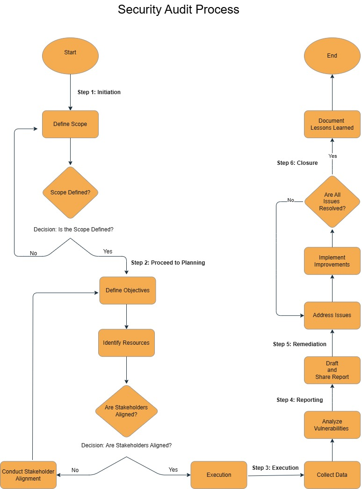

# Security-Audit-Botium-Toys

This repository showcases my work on a security audit project for Botium Toys, a fictional toy company. As part of my learning in the Google Cybersecurity Certificate program, I conducted an internal audit to identify vulnerabilities, check for compliance gaps, and suggest ways to improve their security.

## Documents
- [Botium Toys Controls and Compliance Checklist (PDF)](Docs/Botium_Toys_Controls_and_Compliance_Checklist.pdf)
- [Botium Toys Security Audit Recommendations (PDF)](Docs/Botium_Toys_Security_Audit_Recommendations.pdf)

## Visuals
- [Security Audit Process Flowchart](Visuals/Security_Audit_Process_Flowchart.drawio)  
- This flowchart provides a visual representation of the steps involved in the security audit process.
- 

